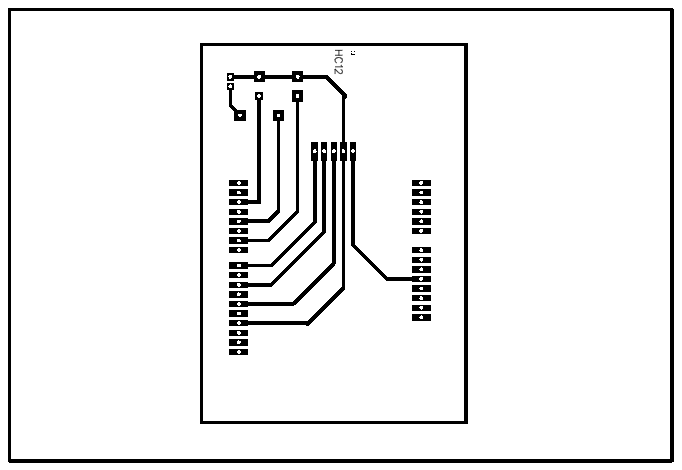
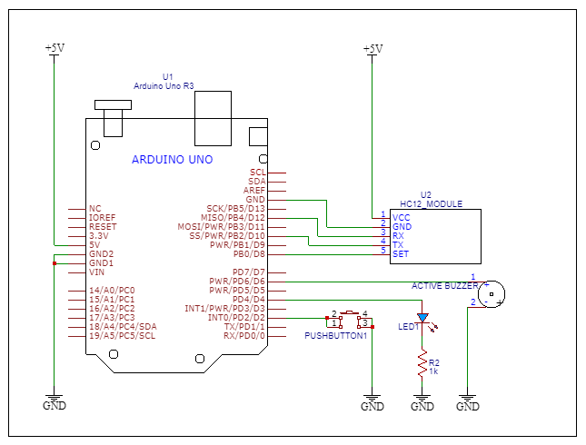
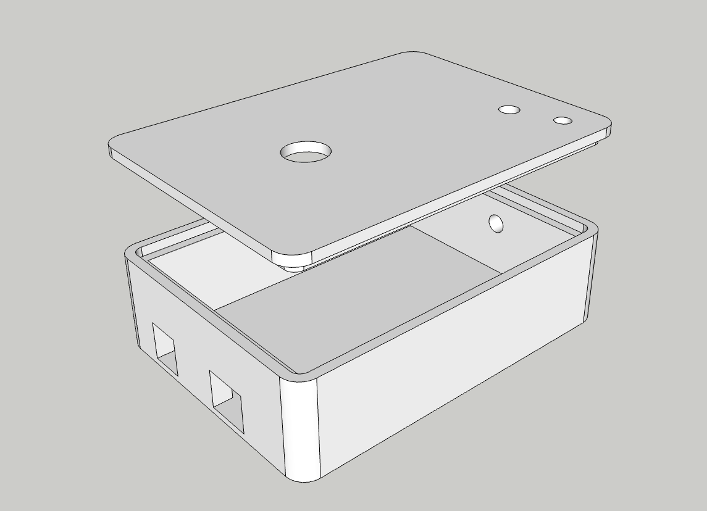

# Basic Morse Code Transceiver

## Introduction
This project demonstrates a simple wireless Morse code communication system using two Arduino boards and HC-12 transceiver modules. It allows users to transmit and receive Morse signals (dot and dash) using a single button, providing audio and visual feedback through a buzzer and an LED.

It's designed for educational purposes, amateur radio practice, or simple wireless signaling.


---

## 🧠 Algorithm Overview

1. **Button Input Detection**

   * Press-and-hold duration determines if the input is a **dot** (`1`) or a **dash** (`2`).
   * A short beep helps identify a long press (dash).

2. **Morse Code Transmission**

   * The encoded value is sent via the **HC-12 wireless module**.
   * Transmission uses SoftwareSerial.

3. **Morse Code Reception**

   * Incoming values are interpreted as dot or dash.
   * Corresponding beeps and LED flashes provide real-time feedback.

4. **Test and Configuration Modes**

   * Optional modes for:

     * Testing LED, buzzer, and button
     * HC-12 communication test
     * Setting initiator behavior

---

## Materials Used


| Component          | Quantity | Description                        |
| ------------------ | -------- | ---------------------------------- |
| Arduino Uno/Nano   | 2        | Microcontroller Board              |
| HC-12 Module       | 2        | 433MHz Wireless Serial Transceiver |
| 5mm Red LED        | 2        | With 220Ω resistor                 |
| Active Buzzer      | 2        | 5V compatible                      |
| Push Button        | 2        | Momentary switch                   |
| Breadboard & Wires | -        | For prototyping                    |
| Power Supply       | 1        | USB or Battery Pack                |

---

## PCB Layout



> The PCB layout was designed to simplify the wiring and reduce the chances of errors during assembly. It includes clearly labeled pads for the button, LED, buzzer, and HC-12 module.

---

## Schematic Diagram



> This schematic shows the electrical connections between the Arduino, button, LED, buzzer, and HC-12 module.
> ✅ Make sure to:
>
> * Use a **current-limiting resistor** (220Ω–330Ω) for the LED.
> * Double-check **TX and RX alignment** when connecting the HC-12 module.
> * Connect the **HC-12 SET pin** to digital pin 8 for entering configuration mode.

---

## 3D Printed Casing



> A custom 3D printed case was designed to house the PCB and provide mounting holes for external button and indicator components. The case ensures portability and protects the electronics during use.

👉 STL files available inside the [`assets/stl/`](assets/stl/) folder.
You can [download the STL files directly here](assets/stl/) if viewing this on a web interface.

---
## Full Code

```cpp
#include <Arduino.h>
#include <SoftwareSerial.h>

// Declare constants for the pin numbers of the button, led, buzzer, and HC12 pins
const byte BUTTON_PIN = 2;                            // Momentary push-button switch accross pin 2 and GND
const byte LED_PIN = 4;                               // 5mm Red LED with current limiting resistor accross pin 4 and GND
const byte BUZZER_PIN = 6;                            // 5V Active Buzzer accross pin 6 and GND
const byte HC12_SET_PIN = 8;                          // HC-12 SET pin for configuration mode (active low) 
const byte HC12_TX_PIN = 10;                          // HC-12 TX pin connected to Arduino RX pin
const byte HC12_RX_PIN = 12;                          // HC-12 RX pin connected to Arduino TX pin 

//Initiate an instance of the Software Serial Object for the HC-12 module
SoftwareSerial morse(HC12_TX_PIN, HC12_RX_PIN);       // RX, TX (Arduino Uno Software Serial)

bool testMode = false;                                // Set to true to enable HC-12 configuration mode
bool isInitiator = false;                             // Set to true if this device is the initiator of the communication
const bool  toTestBuzzerLedAndButton = false;         // Set to true to test buzzer, LED and button functionality
const bool hcTestMode = false;                        // Set to true to enable HC-12 configuration mode
int hc12TestValue = 0;

int morseToSend = 0;                                  // Variable to hold the value to send via HC-12
int morseReceived = 0;                                // Variable to hold the received value from HC-12

unsigned long dashDuration = 600;                     // Duration for dash in milliseconds
unsigned long dotDuration = 200;                      // Duration for dot in milliseconds
unsigned long morseInterval = 1000;                   // Interval between dots and dashes in milliseconds

unsigned long buttonDotPressDuration = 500;           // Duration for button press in milliseconds
unsigned long buttonDashPressDuration = 1000;         // Duration for button press for dash in milliseconds

unsigned long lastButtonPressTime = 0;                // Variable to hold the last button press time

/*
@brief Function to beep the buzzer and LED at the same time
@param _times Number of times to beep
@param _duration Duration of each beep in milliseconds
*/
void beepAndBuzz (int _times, int _duration) {
  for (int i = 0; i < _times; i++) {
    digitalWrite(BUZZER_PIN, HIGH);
    digitalWrite(LED_PIN, HIGH);
    delay(_duration);
    digitalWrite(BUZZER_PIN, LOW);
    digitalWrite(LED_PIN, LOW);
    delay(200); // Delay between beeps
  }
}

/*
*@brief Function to test buzzer, LED and button functionality
*@details When the button is pressed, the LED and buzzer will blink for 500 ms.
*@note This function uses a while loop to keep the LED and buzzer toggle on and off until the button is released.
*@note If the button is pressed and the LED and buzzer doesnt toggle, check the wiring and ensure the button is functioning correctly.
*@note If only the LED or buzzer is not toggling, check the wiring for that specific component.
*/
void testBuzzerLedAndButton() {
  //Blink LED and Buzzer when button is pressed using while loop
  if (digitalRead(BUTTON_PIN) == LOW) {
    while (digitalRead(BUTTON_PIN) == LOW) {
      digitalWrite(LED_PIN, HIGH);
      digitalWrite(BUZZER_PIN, HIGH);
      delay(500); // Keep LED and Buzzer on for 500 ms
      digitalWrite(BUZZER_PIN, LOW);
      digitalWrite(LED_PIN, LOW);
      delay(500); // Keep them off for 500 ms
    }
    //Ensure to turn off LED and Buzzer after button release
    digitalWrite(LED_PIN, LOW);
    digitalWrite(BUZZER_PIN, LOW);
  }
} 

void loopBuzzerLedAndButtonTest() {
  if (toTestBuzzerLedAndButton) {
    testBuzzerLedAndButton();
  }
}

void setupHcTestMode() {
  if (!hcTestMode){
    Serial.println("HC-12 is in normal mode.");
  } else {
    Serial.println("HC-12 is in configuration mode. Please set the parameters as needed.");
    if (isInitiator) {
      delay(1000); // Wait for HC-12 to initialize
      Serial.println("This device is the initiator of the communication.");
      morse.println("1"); // Send a message to the other device
      delay(1000); // Wait for a second before sending the next message
    } else {
      Serial.println("This device is not the initiator of the communication.");
    }
  }
}

void loopHcTestMode() {
  if (hcTestMode) {
    if (morse.available()) {
      String message = morse.readStringUntil('\n');
      hc12TestValue = message.toInt();

      Serial.print("Received: ");
      Serial.print(hc12TestValue);

      if (hc12TestValue > 0) {
        int replyValue = hc12TestValue + 1;
        Serial.print("\tSent: ");
        Serial.println(replyValue);
        delay(500); // Wait for 500 ms before sending the reply
        morse.println(replyValue);

        // ✅ Reset value so we only reply once per message
        hc12TestValue = 0;
      }
    }
  }
}

bool setupHc12() {
  morse.begin(9600);                                      // Start HC-12 serial communication
  pinMode(HC12_SET_PIN, OUTPUT);                          // Set HC-12 SET pin as output
  digitalWrite(HC12_SET_PIN, LOW);                        // Set HC-12 SET pin to LOW to enter configuration mode

  delay(1000);                                            // Let the module initialize

  morse.println("AT");                                    // Send "AT" command to HC-12 to check if functional
  delay(100);                                             // Brief pause to ensure Serial message is sent and response is received

  if (morse.available()) {
    String response = morse.readStringUntil('\n');        // Read response from HC-12 module and print to serial monitor
    Serial.print("HC-12 Response: ");
    Serial.println(response);

    digitalWrite(HC12_SET_PIN, HIGH);                     // Switch to normal mode

    if (response.startsWith("OK")) {                      // Return True if response is "OK"
      Serial.println("HC-12 is ready for configuration.");
      return true;
    } else {
      Serial.println("Failed to configure HC-12.");       // Return False if "OK" response is not received
      return false;
    }
  } else {
    Serial.println("No response from HC-12.");
    digitalWrite(HC12_SET_PIN, HIGH);                     // Switch to normal mode
    return false;
  }
}

/*
*@brief Function to beep the buzzer and LED for a specific duration based on the morse code received
*@param _isDot True for dot, false for dash
*/
void outBeepAndBuzz(bool _isDot) {
  beepAndBuzz(1, _isDot ? dotDuration : dashDuration);    // Beep once for dot, twice for dash
  delay(morseInterval);
}

void morseBeepAndBuzz(int _value) {
  if (_value == 1){
    outBeepAndBuzz(true); // Dot
  } else if (_value == 2) {
    outBeepAndBuzz(false); // Dash
  } else {
    Serial.println("Invalid morse value. Please send 1 for dot or 2 for dash.");
  }
}

int talkMorse() {
  int _morseToSend = 0;
  bool dashBeeped = false;

  if (digitalRead(BUTTON_PIN) == LOW) {
    lastButtonPressTime = millis();

    while (digitalRead(BUTTON_PIN) == LOW) {
      unsigned long holdDuration = millis() - lastButtonPressTime;

      // 🔊 Beep once when dash threshold is reached
      if (!dashBeeped && holdDuration > 1000) {
        digitalWrite(LED_PIN, HIGH);
        digitalWrite(BUZZER_PIN, HIGH);
        delay(100); // Short beep
        digitalWrite(BUZZER_PIN, LOW);
        digitalWrite(LED_PIN, LOW);
        dashBeeped = true;
      }
    }

    delay(50); // Small debounce after release

    unsigned long pressDuration = millis() - lastButtonPressTime;

    if (pressDuration > 100 && pressDuration <= 1000) {
      _morseToSend = 1; // Dot
    } else if (pressDuration > 1000) {
      _morseToSend = 2; // Dash
    }
  }

  return _morseToSend;
}

/*
* @brief Function to setup IO pins for button, LED and buzzer
*/
void setupIoPins() {
  pinMode(BUTTON_PIN, INPUT_PULLUP);                     // Set button pin as input with pull-up resistor
  pinMode(LED_PIN, OUTPUT);                              // Set LED pin as output
  pinMode(BUZZER_PIN, OUTPUT);                           // Set buzzer pin as output

  digitalWrite(LED_PIN, LOW);                            // Ensure LED is off at startup
  digitalWrite(BUZZER_PIN, LOW);                         // Ensure buzzer is off at startup

  Serial.println("-----------------------------------");
  Serial.println("IO Pins Initialized");
  Serial.print("Button Pin: ");
  Serial.println(BUTTON_PIN);
  Serial.print("LED Pin: ");
  Serial.println(LED_PIN);
  Serial.print("Buzzer Pin: ");
  Serial.println(BUZZER_PIN);
  Serial.println("-----------------------------------");
}

void setup() {
  Serial.begin(9600);                                 // Start Serial communication for debugging
  setupIoPins();                                      // Setup IO pins for button, LED and buzzer
  setupHcTestMode();


  // Initialize HC-12 module
  if(setupHc12()) {                                   // If HC-12 setup is successful beep and buzz for 200 milliseconds for 5 times
    Serial.println("HC-12 setup successful.");
    beepAndBuzz(5, 200);
  } else {                                            // If HC-12 setup fails beep and buzz for 3 seconds three time 
    beepAndBuzz(3, 3000);                               
    Serial.println("HC-12 setup failed.");
  }

}

void loop() {
  loopBuzzerLedAndButtonTest();                                        // Test buzzer, LED and button functionality if enabled
  loopHcTestMode();                                                    // Loop for HC-12 test mode if enabled      

  // Priority is listen mode, button cannot be pressed while receiving morse code from other devices
  // System is designed to receive morse code from other devices and send morse code when button is pressed
  // Where 1 is dot and 2 is dash
  // If morse code is received, it will be beeped and buzzed
  if (morse.available()) {
    String message = morse.readStringUntil('\n');                       // Get message from HC-12 module and print to serial monitor
    Serial.print("Received: ");
    Serial.println(message);

    morseReceived = message.toInt();                                    // Convert the received message to an integer, if it is not a valid integer, it will be 0

    if(morseReceived > 0) {                                             // If the received message is greater than 0, it is a valid morse code
      Serial.print("Morse Received: ");
      Serial.println(morseReceived);
      morseBeepAndBuzz(morseReceived);                                  // Perform corresponding beep and buzz for the received morse code
    }
  } else {
    //Listen for button press if no morse code is available to output
    morseToSend = talkMorse ();                                         // Call the function to check if the button is pressed and get the morse code to send

    if (morseToSend > 0) {                                              // If the button press is valid, it will be either 1 or 2  
      Serial.print("Sending: ");
      Serial.println(morseToSend);
      morse.println(morseToSend);                                       // Send the morse value via HC-12
    }
  }
}

```

---

## 💖 Support Us

If you found this project helpful, consider supporting our future open-source educational projects.

### 📱 GCash Number

```
0963-214-6348
```

> Your support goes a long way in funding components and tools for STEM-based outreach and tutorials!

---